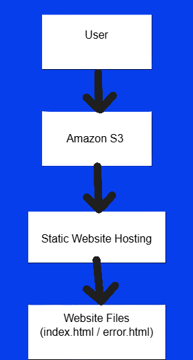
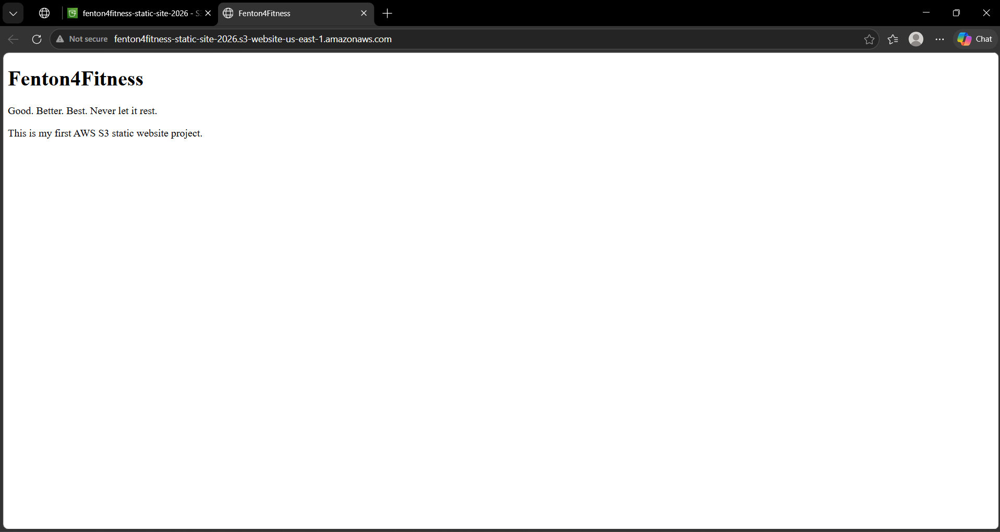
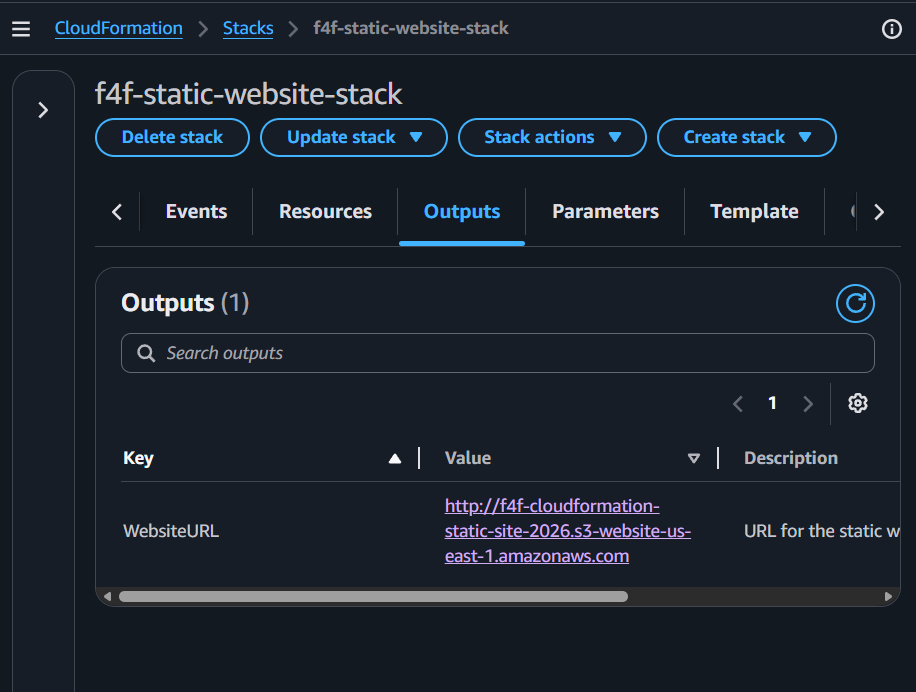
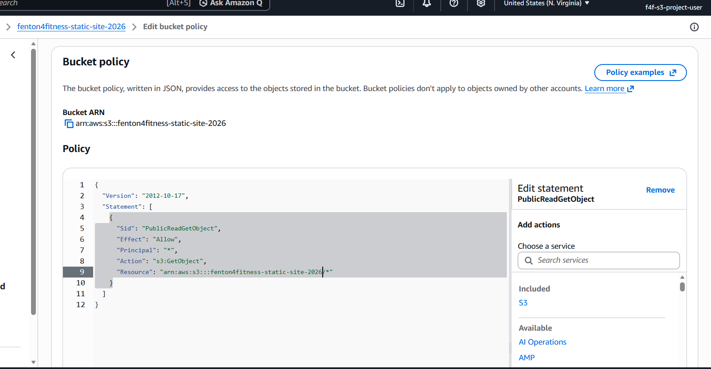

# AWS S3 Static Website Project

This project demonstrates how to host a static website using Amazon S3 through multiple deployment methods:

- AWS Console
- AWS CLI
- AWS CloudFormation

---

## Project Goals

- Learn AWS S3 static website hosting
- Practice IAM security best practices
- Configure bucket policies and public access
- Deploy infrastructure using CloudFormation
- Document deployment workflows professionally

---

## Skills Demonstrated

- AWS S3 static website hosting
- IAM security setup
- AWS CLI usage
- CloudFormation infrastructure as code
- JSON bucket policy configuration
- YAML template editing
- GitHub documentation
- Architecture diagramming

---

## Technologies Used

- Amazon S3
- AWS IAM
- AWS CLI
- AWS CloudFormation
- JSON Bucket Policies
- YAML Templates

---

## Deployment Methods

### AWS Console
The website was manually configured through the AWS Management Console to understand the full workflow and settings involved in static website hosting.

### AWS CLI
The project was also deployed using AWS CLI commands to practice command-line cloud management and credential configuration.

### AWS CloudFormation
Infrastructure was deployed using a reusable YAML CloudFormation template to practice Infrastructure as Code (IaC) concepts and automated provisioning.

---

## Website Features

- Static website hosting
- Custom index page
- Custom error page
- Public bucket policy configuration
- CloudFormation Outputs

---

## Live Website

CloudFormation Deployment:

http://f4f-cloudformation-static-site-2026.s3-website-us-east-1.amazonaws.com

---

## Architecture

User → Amazon S3 Bucket → Static Website Hosting

---

## Architecture Diagram


---

## Project Structure

```text
Project-01-S3-Static-Website
│
├── documentation
├── screenshots
├── templates
├── website-files
├── bucket-policy.json
```

---

## CloudFormation Features

The CloudFormation template includes:

- Automated S3 bucket creation
- Static website hosting configuration
- Website endpoint Outputs
- Infrastructure as Code (IaC) deployment
- Reusable YAML infrastructure template

---

## Lessons Learned

- S3 bucket names must be globally unique
- Public access settings and bucket policies are separate
- IAM users are safer than using the root account
- CloudFormation uses strict YAML formatting and indentation
- Outputs can automatically return resource information after deployment
- AWS CLI requires properly configured credentials
- Infrastructure as Code improves repeatability and automation

---

## Challenges & Troubleshooting

### YAML Formatting Errors
CloudFormation templates are highly sensitive to indentation and formatting. Incorrect indentation caused validation errors when adding Outputs to the template.

### Public Access Configuration
S3 bucket policies alone were not enough to make the website public. Block Public Access settings also had to be configured correctly.

### GitHub File Path Issues
Image links inside the README initially failed due to incorrect file paths and naming inconsistencies.

### File Naming Consistency
Several files were accidentally saved with duplicate extensions such as `.json.json` and `.png.png`, reinforcing the importance of careful naming conventions and organization.

---

## Project Screenshots

### Live Static Website



---

### CloudFormation Outputs



---

### Bucket Policy Configuration



